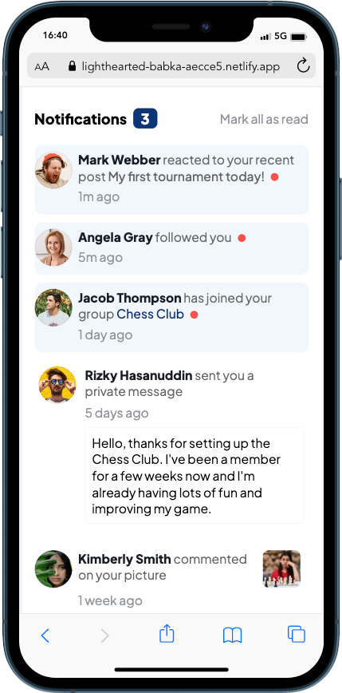
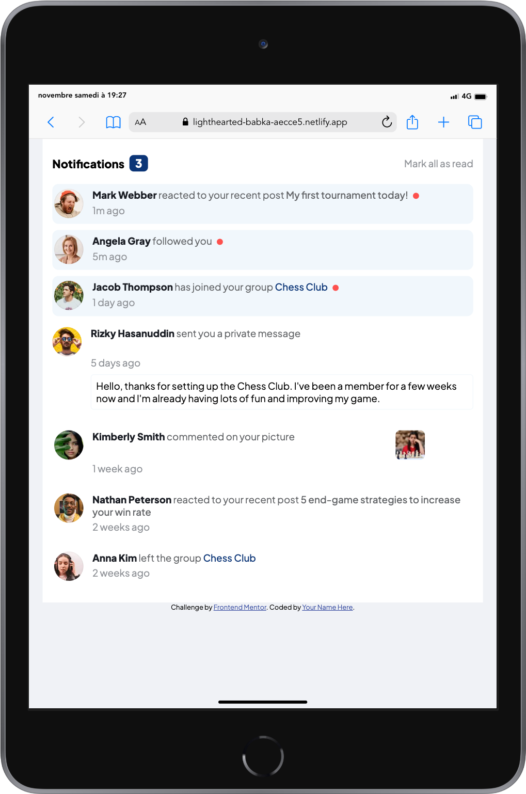
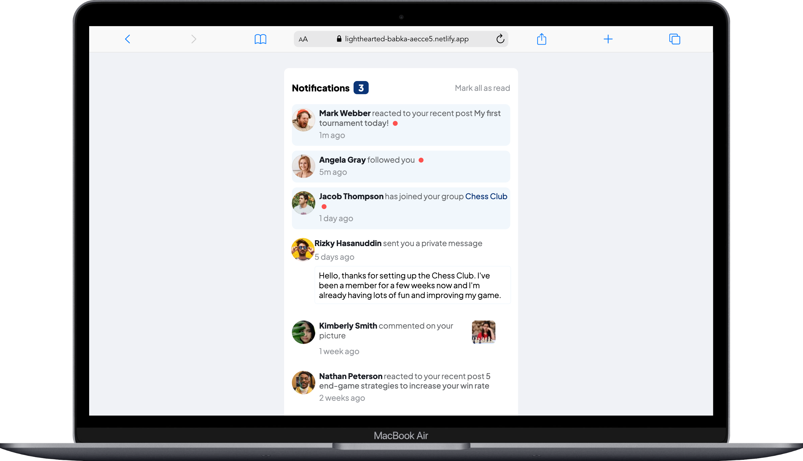

# Frontend Mentor - Notifications page solution

This is a solution to the [Notifications page challenge on Frontend Mentor](https://www.frontendmentor.io/challenges/notifications-page-DqK5QAmKbC). Frontend Mentor challenges help you improve your coding skills by building realistic projects.

## Table of contents

- [Overview](#overview)
  - [The challenge](#the-challenge)
  - [Screenshot](#screenshot)
  - [Links](#links)
- [My process](#my-process)
  - [Built with](#built-with)
  - [Continued development](#continued-development)
  - [Useful resources](#useful-resources)
- [Author](#author)

## Overview

### The challenge

Users should be able to:

- Distinguish between "unread" and "read" notifications
- Select "Mark all as read" to toggle the visual state of the unread notifications and set the number of unread messages to zero
- View the optimal layout for the interface depending on their device's screen size
- See hover and focus states for all interactive elements on the page

### Screenshot

#### iPhone 12 pro screenshot

#### iPad screenshot

#### Macbook screenshot

### Links

- Live Site URL: [live site URL here](https://lighthearted-babka-aecce5.netlify.app/)

## My process

### Built with

- Semantic HTML5 markup
- CSS custom properties
- Flexbox
- CSS Grid
- Mobile-first workflow

### Continued development

I wan't to perfect my craft in [Tailwind.css](https://tailwindcss.com/)

### Useful resources

- [CSS Grid](https://css-tricks.com/snippets/css/complete-guide-grid/) - This helped me to align elements in the notification item with the opened message.

## Author

- Website - [Cisoo91](https://www.your-site.com)
- Frontend Mentor - [@Ciscoo91](https://www.frontendmentor.io/profile/Ciscoo91)
- Twitter - [@Francisco_Mambo](https://twitter.com/Francisco_Mambo)
